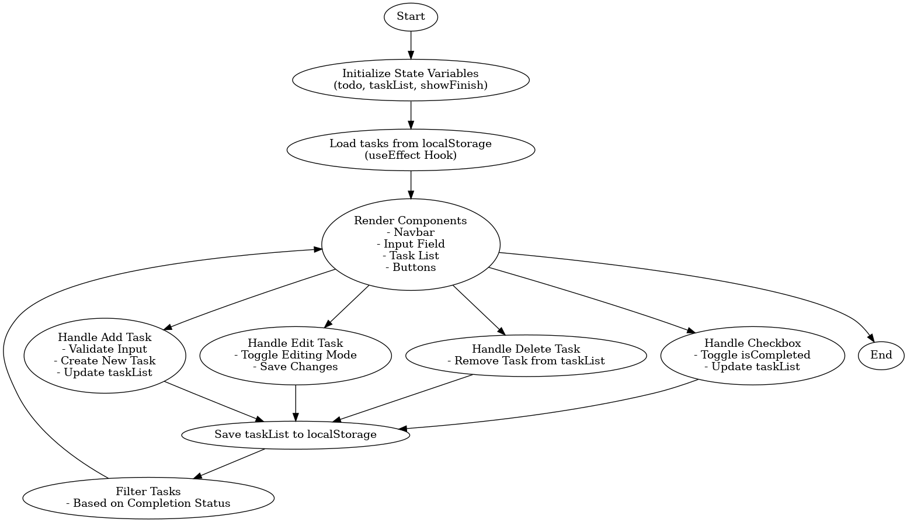

# Todo List App

## Overview

The Todo List App is a simple and intuitive task management application built using React. It allows users to add, edit, delete, and mark tasks as completed. The app also provides the ability to filter tasks based on their completion status and persists data using `localStorage`.

## Features

1. **Add Tasks**: Users can add new tasks to the list by entering text and clicking the "Add" button or pressing the Enter key.
2. **Edit Tasks**: Tasks can be edited by clicking the edit button, modifying the text, and saving the changes.
3. **Delete Tasks**: Users can delete tasks by clicking the delete button.
4. **Mark as Completed**: Tasks can be marked as completed using a checkbox.
5. **Filter Tasks**: Users can toggle between showing all tasks or only incomplete tasks.
6. **Persistent Storage**: Tasks are saved in `localStorage` to ensure data is retained even after refreshing the page.

## Components

### 1. **Navbar**
   - A placeholder for the app's navigation bar.

### 2. **Input Field**
   - Allows users to input new tasks.

### 3. **Task List**
   - Displays the list of tasks with options to edit, delete, or mark them as completed.

### 4. **Buttons**
   - Includes buttons for adding tasks, saving edits, and toggling task completion.

## State Management

The app uses React's `useState` and `useEffect` hooks for state management:
- `todo`: Stores the current input value for a new task.
- `taskList`: Stores the list of tasks.
- `showFinish`: Toggles between showing all tasks or only incomplete tasks.

## Data Persistence

The app uses `localStorage` to save and load tasks. This ensures that tasks remain available even after the browser is refreshed.

## How It Works

1. **Initialize State Variables**: The app initializes state variables for tasks and loads existing tasks from `localStorage` using the `useEffect` hook.
2. **Render Components**: The app renders the Navbar, Input Field, Task List, and Buttons.
3. **Handle User Actions**:
   - Add Task: Validates input, creates a new task, and updates the task list.
   - Edit Task: Toggles editing mode and saves changes.
   - Delete Task: Removes a task from the list.
   - Mark as Completed: Toggles the `isCompleted` status of a task.
   - Filter Tasks: Filters tasks based on their completion status.
4. **Save to localStorage**: Updates `localStorage` whenever the task list changes.

### Workflow Diagram

Below is the workflow diagram illustrating the app's functionality:



## Project Structure

```
todoList App/
├── src/
│   ├── App.jsx         # Main application logic
│   ├── components/
│   │   ├── Navbar.jsx  # Navbar component
│   └── ...             # Other components and files
├── README.md           # Project documentation
└── ...                 # Other project files
```

## How to Run

1. Clone the repository:
   ```bash
   git clone <repository-url>
   ```
2. Navigate to the project directory:
   ```bash
   cd todoList App
   ```
3. Install dependencies:
   ```bash
   npm install
   ```
4. Start the development server:
   ```bash
   npm start
   ```
5. Open the app in your browser at `http://localhost:3000`.

## Future Enhancements

- Add due dates for tasks.
- Implement categories or tags for tasks.
- Add user authentication for personalized task lists.
- Improve UI/UX with animations and themes.

## License

This project is licensed under the MIT License.
